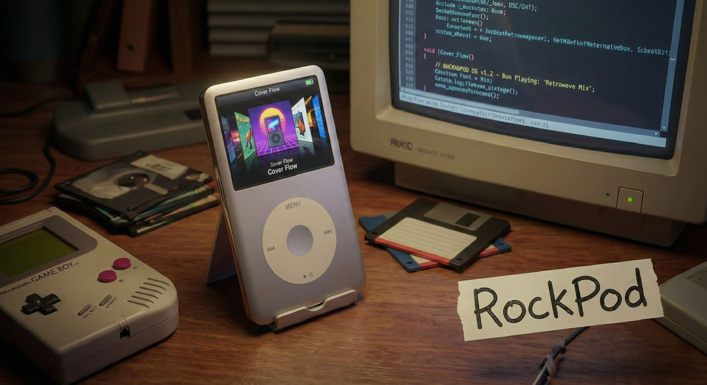

<p align="center">
  
  <h1 align="center">RockBox_Personal</h1>
  <p align="center">
    Personal Rockbox / rockpod fork for iPod Classic and iPod Video.<br>
    Upstream rockpod features, plus local theme, boot, simulator, and plugin work.
  </p>
</p>

---

## What This Repo Is

`RockBox_Personal` is a personal integration fork built on top of:

- the [Rockbox](https://www.rockbox.org/) project
- upstream [rockpod](https://github.com/nuxcodes/rockpod)

The goal of this repo is not to replace the credit or history of those projects. It is a working branch that keeps the upstream iPod improvements from `rockpod` and layers personal customizations on top for daily use and testing on real hardware.

---

## What Is In This Fork Right Now

### Inherited From Upstream rockpod

These features come from upstream `rockpod` and remain the base of this repo:

- MFi digital audio output for iPod Classic
- rewritten Cover Flow
- dynamic album-art-based UI colors
- SSD-aware storage and power-management work
- UI cleanup across menus, WPS, and related screens

If you want the original write-up for those features, see the upstream [`rockpod` project](https://github.com/nuxcodes/rockpod).

### Personal Changes Currently Carried Here

This fork currently includes the following custom work on top of `rockpod`:

- restored local source changes from the working `rockpod` tree used on-device
- `iPone` theme support with the required configs, WPS/SBS/FMS files, icons, backdrops, and fonts
- custom full-screen color boot splash for 320x240 targets
- iPod simulator `W/A/S/D` keyboard shortcuts for faster testing
- in-tree plugin work for `PocketCatch`
- in-tree `Minish Cap` source/plugin work

### iPone-Specific Notes

The `iPone` setup in this repo is intended to include the runtime pieces needed for the theme to work correctly on-device:

- `themes/iPone.cfg`
- `themes/iPone_optimized.cfg`
- `wps/iPone.wps`
- `wps/iPone.sbs`
- `wps/iPone.fms`
- `icons/iPone.bmp`
- `backdrops/iPone_bd.bmp`

### Boot Splash

This branch currently uses a custom full-screen boot image path for compatible 320x240 color targets. The source art is resized for device use and built into:

- `apps/bitmaps/native/rockboxlogo.320x98x16.bmp`

The full-screen draw path is wired through:

- `apps/main.c`
- `bootloader/show_logo.c`

### PocketCatch / Plugin Work

This repo also carries active plugin-side work that is still evolving:

- `apps/plugins/pocketcatch.c`
- `apps/plugins/pocketcatch_simple.c`
- `apps/plugins/pc_input.c`

Treat this area as work in progress rather than a finished, documented feature set.

---

## Supported Models

| Feature | iPod Classic (6G/7G) | iPod Video (5G/5.5G) |
| --- | --- | --- |
| Upstream rockpod UI features | Yes | Yes |
| MFi digital audio | Yes | Upstream work exists, hardware status should be treated as experimental |
| iPone theme | Yes | Yes |
| Custom boot splash | Yes | Yes |
| Simulator key customizations | Yes | Yes |

---

## Build

```bash
# Hardware build: iPod Classic 6G/7G
./build-hw.sh

# Hardware build: iPod Video 5G/5.5G
./build-hw.sh 5g

# Simulator build: default iPod Classic 6G/7G
./build-sim.sh
```

The helper scripts configure, build, and install into the expected build directories:

- `build-hw-ipod6g`
- `build-hw-ipodvideo`
- `build-sim`

For a separate iPod Video simulator build, use a dedicated directory:

```bash
mkdir -p build-sim-video
cd build-sim-video
../tools/configure --target=ipodvideo --type=s
make -j$(sysctl -n hw.ncpu)
make install
```

Manual rebuild examples:

```bash
cd build-hw-ipod6g && make -j$(sysctl -n hw.ncpu) && make zip
cd build-hw-ipodvideo && make -j$(sysctl -n hw.ncpu) && make zip
cd build-sim && make -j$(sysctl -n hw.ncpu) && make install
```

Cross-compiler setup remains the standard Rockbox toolchain flow via `tools/rockboxdev.sh`.

---

## Install

> Your iPod must already have a Rockbox bootloader installed.

1. Build or download the correct package for your target.
2. Connect the iPod in disk mode.
3. Extract the resulting `.zip` to the root of the iPod so it updates `.rockbox`.
4. Eject and reboot.

When testing theme-heavy changes, make sure the updated `.rockbox` assets are copied along with the binary build.

---

## Current Status

This repo should be treated as a personal working fork, not a polished upstream release branch.

- feature work may land here before it is cleaned up for release
- theme and asset changes may matter as much as code changes
- simulator helpers exist for development convenience
- plugin/game work is still in progress

---

## Credits

This repo stands on the work of other developers, and that credit should stay visible:

- [Rockbox](https://www.rockbox.org/) and all Rockbox contributors for the base firmware, toolchain, and plugin ecosystem
- [nuxcodes](https://github.com/nuxcodes) and the upstream [rockpod](https://github.com/nuxcodes/rockpod) project for the iPod-specific feature foundation used here
- [Dook](https://github.com/D0-0K) for theme work that inspired or supplied bundled/customized theme assets
- [oandrew/ipod-gadget](https://github.com/oandrew/ipod-gadget) and [mojyack/rockbox](https://github.com/mojyack/rockbox) for MFi / iAP-related reference material used by upstream rockpod

Any game, plugin, or theme content carried here remains credited to its original authors and upstream projects. This repository mainly reflects integration, adaptation, testing, and personal customization work on top of that foundation.

## License

[GNU General Public License v2.0](https://www.gnu.org/licenses/old-licenses/gpl-2.0.html)
